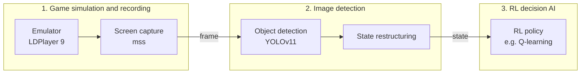
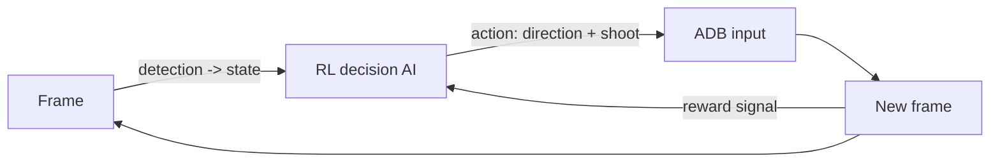

# BROWT

[](https://victor11w.github.io/BROWT/)

Brawl Stars bot trained with reinforcement learning. MVP target: Solo Showdown.
Platform: Windows + NVIDIA GPU (CUDA). Large project, built step by step. Current
priority: the detection step.

> ## Full scientific documentation
>
> **A precise, structured scientific report — method and results — is published at**
> **[victor11w.github.io/BROWT](https://victor11w.github.io/BROWT/)**.
>
> It documents the experimental approach and the evidence gathered at each stage
> of the pipeline (perception, state, RL). **This is the primary reference for the
> project** — the sections below are only a summary.

## Pipeline

### Work axes (3 groups)



### AI feedback loop



The resulting frames provide the reward signal back to the AI.

1. LDPlayer 9 runs Brawl Stars at a fixed resolution, ADB enabled; `mss`
   captures the emulator window into a numpy frame.
2. YOLOv11 (Ultralytics), trained on the Roboflow dataset, returns bounding
   boxes; detections are restructured into a state.
3. The RL policy maps the state to an action (a movement direction + shoot
   yes/no); the action is injected back into LDPlayer via ADB (swipe =
   joystick, tap = shoot/super).


## Libraries per step

| Step | Tool / library |
|------|----------------|
| Emulator | LDPlayer 9 (Windows) |
| Screen capture | mss + numpy + opencv-python |
| Inputs (ADB) | platform-tools adb / pure-python-adb |
| Detection | ultralytics (YOLOv11) |
| Dataset | Roboflow bloxxy/brawl-stars-dataset (MIT) |
| RL (future) | stable-baselines3, gymnasium, torch (CUDA) |
| Logs (future) | tensorboard |

## Detection classes

Dataset: [bloxxy/brawl-stars-dataset](https://universe.roboflow.com/bloxxy/brawl-stars-dataset)
(10 classes): `Me`, `Enemy`, `Friendly`, `Safe_Enemy`, `Safe_Friendly`, `Gem`,
`Ball`, `PP`, `PP_Box`, `Hot_Zone`.

## RL model

- Input: full detected state (positions of all detected classes).
- Output: a movement direction, plus a boolean action (shoot or not).
- Theory not finalized yet. Q-learning was experimented with and is a
  plausible candidate.

## Roadmap

| # | Step | Status |
|---|------|--------|
| 1 | Detection: LDPlayer + ADB, mss capture, YOLO inference | In progress (priority) |
| 2 | State extraction from detections | To define |
| 3 | RL model (state -> direction + shoot) | To define |
| 4 | ADB input injection + reward / training loop | To define |

## Open questions

- YOLO detects mobile entities but not static terrain (bushes, walls). Ideal:
  source static map layout data per map instead of detecting it from the image.
  Unresolved for now.

## Setup

```
pip install -r requirements.txt
```

Also requires Android platform-tools (`adb`) and LDPlayer 9 with ADB enabled.

Full method, results, and design rationale: the published documentation at
**[victor11w.github.io/BROWT](https://victor11w.github.io/BROWT/)** (sources in
`docs/`).
